## Introduction to Deep Learning
# Part 2 - Non Linear Perceptron


```python
import numpy as np
import utils_plot as uplot
import matplotlib.gridspec as gridspec
from sklearn.metrics import accuracy_score, log_loss
from keras.datasets import mnist
import matplotlib.pyplot as plt
%matplotlib inline  
```

    Using TensorFlow backend.
    

## OK this was learning, but were is the Deep ?
* Well we can add more layers to our perceptron, 
* but it will not change nothing. <br>
> Simple algebra show that any feed forward neural network, with linear activation function, can be reduced to a one layer perceptron.

* **A percepron with linear activation function, is a linear classifier.**<br>
* **Linear Perceptron can distinguish data that is linearly separable.** <br>
* **To extend learning, we need to use non-linear activation functions**

### Non Linear Activation function

Non Linear activation function, Allow model to generalize better.


#### Sigmoid activation function
logistic function, which ranges from 0 to 1
Used as last layer, guarantee to output probability<br>
The logistic sigmoid function can cause a neural network to get stuck at the training time.
#### Logistic Sigmoid:  
$$\sigma(x)=\frac{1}{1+e^{-x}}$$

##### characteristics  of Sigmoid function:
* Smooth, derivable and map any value to (0,1).
* Y values are steep in (-2,2), That means this function tends to bring the activations to either side of the curve, which creates clear distinction. So Sigmoid function, is a good classifier.
* Y values flattens when we move from zero, meaning Y response to change in X is very small to almost none, causing the net to stop learning or learn very slowly. This problem is also called "vanishing gradient", and we will discus it more later.


```python
uplot.drow_sigmoid()
```


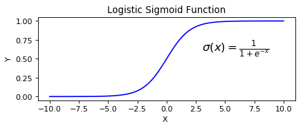


#### Tanh Sigmoid:  
hyperbolic tangent that ranges from -1 to 1
$$\tanh(x)=\frac{e^{x}-e^{-x}}{e^{x}+e^{-x}}$$
With simple algebra, we get:
$$\tanh(x)=\frac{2}{2+e^{-2x}} - 1 = 2\sigma(2x) - 1$$

So tanh not only look similar to Sigmoid, but its a scaled sigmoid function. So characteristics, is quit similar to logistic sigmoid.The main difference is that tanh is steeper near Zero, and maps input to (-1, 1)


```python
uplot.drow_tanh()
```


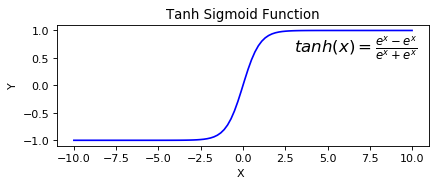


### ReLU (Rectified Linear Unit) Activation Function

The ReLU is the most used activation function in the world right now.Since, it is used in almost all the convolutional neural networks or deep learning.<br>
### *relu(x)=max(0,x)*

#### ReLU characteristics:

* The range of ReLu is The range of ReLu is \[0, inf). This means it can blow up the activation.
* In a large network, the Sigmoid activation function, will "fire" all the time, causing a dense and costly network. Relu, due to output 0 for negative values of x, will cause a spars,more efficient network.
* 


```python
relu = lambda x:  np.maximum(0, x)
uplot.drow_function(func=relu, func_name='Rectified Linear Unit',
                 func_formula = r'$relu(x)=max(0,x)$')
```


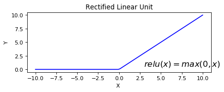


### Sofmax
Softmax actually extends Sigmoid to the multi class case. Softmax assigns probability to each class in a multi-class problem. Those probabilities must be positive and add up to 1.0.<br>
Softmax is used in a neural network as the layer just before the output layer, and the number of outputs, is same as the number of classes we need to classify.
$$Sofmax: p(y = j|\textbf{x})  = \frac{e^{(\textbf{w}_j^{T}\textbf{x} + b_j)}}{\sum_{k\in K} {e^{(\textbf{w}_k^{T}\textbf{x} + b_k)}} }$$

$$\texttt{accuracy}(y, \hat{y}) = \frac{1}{n_\text{samples}} \sum_{i=0}^{n_\text{samples}-1} 1(\hat{y}_i = y_i)$$
#### Example:


```python
def sofmax_func(z):
    return (np.exp(z)/np.sum(np.exp(z)))
```


```python
print('[8,4,8] => ',sofmax_func([8,4,8]))
print('[1,2,3,4] => ',sofmax_func([1,2,3,4]))
print('[-2,2,-2,2] => ',sofmax_func([-2,2,-2,2]))
```

    [8,4,8] =>  [ 0.49546264  0.00907471  0.49546264]
    [1,2,3,4] =>  [ 0.0320586   0.08714432  0.23688282  0.64391426]
    [-2,2,-2,2] =>  [ 0.0089931  0.4910069  0.0089931  0.4910069]
    

## Handwritten Digit Classification (Mnist ) 
### Classification example
Based on:
* https://www.coursera.org/learn/neural-networks/lecture/zO1Is/a-simple-example-of-learning-6-min<br>
We will train a simple FFN - Perceptron on Mnist data.

#### Load Minst Data


```python
from sklearn.utils import shuffle

batch_size = 128
num_classes = 10
epochs = 20

# the data, split between train and test sets
(x_train, y_train), (x_test, y_test) = mnist.load_data()
x_train, y_train = shuffle(x_train, y_train , random_state=0)

x_train = x_train.astype('float32')
x_test = x_test.astype('float32')
x_train /= 255.
x_test /= 255.
print(x_train.shape[0], 'train samples')
print(x_test.shape[0], 'test samples')
```

    60000 train samples
    10000 test samples
    

#### Lest View some examples


```python
import matplotlib as mpl
mpl.rc('image', cmap='gray')

print(x_train[0].shape)
print('Lables are: ', y_train[0:8])
uplot.show_list_images(x_train[0:8])
print('Lables are: ', y_train[70:78])
uplot.show_list_images(x_train[70:78])
```

    (28, 28)
    Lables are:  [3 6 6 6 0 3 6 2]
    Lables are:  [3 1 1 1 4 8 5 4]
    


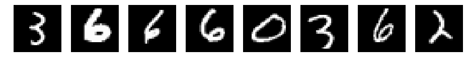


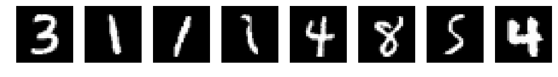


### Perceptron Scheme
* **Weights** will have following shape:  (n_classes, 28*28+1) 
> The one is for the bias, For clarity, we will draw only the first 28*28 weights

* **Predict** - predict the class that has the largest probability 
> We can Measure "larger impact" or probability by by applying $Sofmax$ on $Wx$,and choosing the class with maximal probability.


#### Update the weights
* **Correct** - If predictions correct, do nothing
* **misclassified** - if prediction is wrong:
    * Increase the weights of the correct class by input's active pixels 
    * Decrease the weights of misclassified class by input's active pixels 
<br>


argmax useful numpy function function, to chose the class with maximal index


```python
def predict(w, x):

    pred_val = np.dot(w, np.append(x, 1))
    pred_class = np.argmax(sofmax_func(pred_val))
    return pred_class
```


```python
def clasify_mnist(X, Y,n_classes=10,num=100, epoch=1):
    
       
    np.random.seed(70)

    #w = np.zeros((n_classes,28*28+1))
    w = np.random.random_sample((n_classes,28*28+1))
    
    n_epoch = epoch
    num = num

    for j in range(n_epoch):
        
        acc = 0
        order = np.random.permutation(num)
        
        for i in range(num):

            x, y = X[order[i]], Y[order[i]]
            yhat = predict(w, x)
            
            if y == yhat:
                acc += 1
            else:
                
                w[y] += np.append(x, 1)
                w[yhat] -= np.append(x, 1)
            
        accuracy = acc / float(num)
        print ('Iteration %d: acc = %f' % (j+1, accuracy))
                
    return w
```

#### View the weighst after one sample


```python
w = clasify_mnist(x_train, y_train,num=1,epoch=1)
uplot.show_list_images([w[i,0:28*28].reshape((28,28)) for i in range(10)])
l1 = [w[i,0:28*28].reshape((28,28)) for i in range(10)].copy()
```

    Iteration 1: acc = 0.000000
    


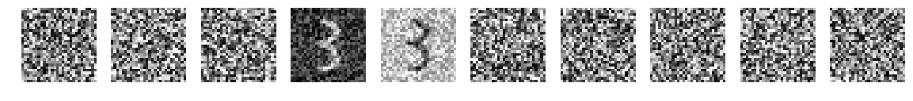


```python
plt.imshow(x_train[0])
```


    <matplotlib.image.AxesImage at 0x10b30320898>


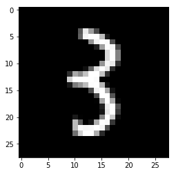


#### View the weighst after one iteration over 100 samples


```python
w = clasify_mnist(x_train, y_train, num=100, epoch=1)
uplot.show_list_images([w[i,0:28*28].reshape((28,28)) for i in range(10)])
l2= [w[i,0:28*28].reshape((28,28)) for i in range(10)].copy()
```

    Iteration 1: acc = 0.380000
    


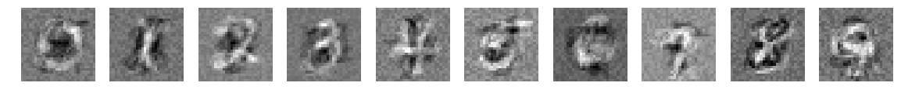


#### View the weighst after 5 iterations over 500 samples


```python
w = clasify_mnist(x_train, y_train, num=500, epoch=5)
uplot.show_list_images([w[i,0:28*28].reshape((28,28)) for i in range(10)])
l3=[w[i,0:28*28].reshape((28,28)) for i in range(10)].copy()
```

    Iteration 1: acc = 0.570000
    Iteration 2: acc = 0.790000
    Iteration 3: acc = 0.850000
    Iteration 4: acc = 0.888000
    Iteration 5: acc = 0.936000
    


We can see that the dark areas are performing mark the "unwanted" areas.
For example, the dark area inside the zero.

The bright areas mark the "wanted" areas, as the bright stripe in the one.
#### View the weights after 5 iterations over 800 samples


```python
w = clasify_mnist(x_train, y_train, num=800, epoch=5)
uplot.show_list_images([w[i,0:28*28].reshape((28,28)) for i in range(10)])
l4=[w[i,0:28*28].reshape((28,28)) for i in range(10)].copy()
```

    Iteration 1: acc = 0.670000
    Iteration 2: acc = 0.817500
    Iteration 3: acc = 0.878750
    Iteration 4: acc = 0.887500
    Iteration 5: acc = 0.913750
    


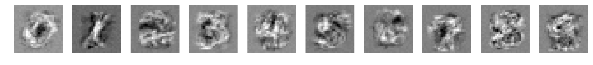


Lets view how the weights change along iterations.


```python
uplot.show_list_images(l1)
uplot.show_list_images(l2)
uplot.show_list_images(l3)
uplot.show_list_images(l4)
```


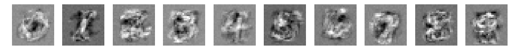


### Predict 
Check prediction accuracy.


```python
def pred_mnist(w,inputs):
    pred=[]
    
    for x in inputs:
        
        yhat = predict(w, x)
        pred.append(yhat)
    return pred
```

### Lets View some predictions


```python
p = pred_mnist(w, x_train[22:30])
print('Predictions: ',p)
print('True lables: ', y_train[22:30])
```

    Predictions:  [8, 7, 0, 0, 3, 7, 0, 6]
    True lables:  [8 7 0 0 3 7 0 6]
    


```python
plt.imshow(x_train[23])
```


    <matplotlib.image.AxesImage at 0x10b2fe8c4e0>


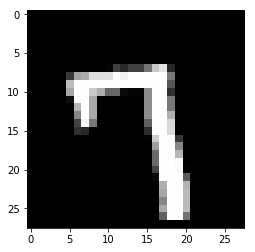


### Evaluate
All though accuracy is not the best measure for classification,we will use it For simplicity - accuracy score:<br>
    $$\texttt{accuracy}(y, \hat{y}) = \frac{1}{n_\text{samples}} \sum_{i=0}^{n_\text{samples}-1} 1(\hat{y}_i = y_i)$$


```python
y_pred = pred_mnist(w,x_train)
print('accuracy on train group:', accuracy_score(y_train, y_pred))
```

    accuracy on train group: 0.814883333333
    


```python
y_pred_test = pred_mnist(w,x_test)
print('accuracy on test group:', accuracy_score(y_test, y_pred_test))
    
```

    accuracy on test group: 0.822
    

## Conclusion
As we saw, This simple perceptron learned pretty well the Mnist dataset, but it mainly learned templates, it will not be able to generalize. To generalize, the net should learn features, not templates.<br>
To learn features, we will need a deeper network, so the first layers will learn features, and the last layers, can learn predictions  from the features.<br>
To do all that we need:
* a well defined learning method, since in deep network, we can not compare the neuron to the output to the labels.
* Practical tools to build more complex nets. 

All that in the next chapters.
